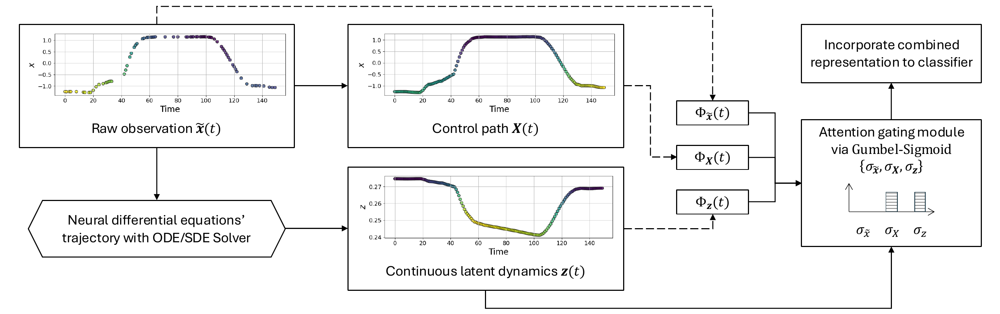

# TANDEM: Temporal Attention-guided Neural Differential Equations for Missingness in Time Series Classification

[](https://cikm2025.org/)
[](https://doi.org/10.1145/3746252.3760996)
[](LICENSE)
[](https://www.python.org/)
[](https://pytorch.org/)

> Official implementation of **TANDEM**, published at the 34th ACM International Conference on Information and Knowledge Management (**CIKM '25**), Seoul, Republic of Korea. [[Paper]](https://dl.acm.org/doi/10.1145/3746252.3760996)

Handling missing data in time series classification remains a significant challenge across domains such as healthcare and sensor analytics. Traditional approaches often depend on imputation, which may introduce bias or fail to capture the underlying temporal dynamics.

**TANDEM** (*Temporal Attention-guided Neural Differential Equations for Missingness*) is a framework that integrates **raw observations**, **interpolated control paths**, and **continuous latent dynamics** through a novel **temporal attention** mechanism. By doing so, the model focuses on the most informative aspects of the data and achieves robust classification performance under missingness. Across **30 benchmark datasets** and a **real-world medical dataset (PhysioNet Sepsis)**, TANDEM outperforms existing state-of-the-art methods while offering interpretability into how missing values are handled.

---

## Method overview

TANDEM unifies three complementary views of an incomplete time series and lets a temporal attention mechanism decide where each view should drive the latent dynamics:



> **Conceptual overview of TANDEM.** For a time series with potentially missing values, three feature streams are processed: (i) the raw observation $\tilde{x}(t)$, (ii) an interpolated, piecewise-smooth control path $X(t)$, and (iii) continuous latent dynamics $z(t)$ from an NDE backbone. Each stream is refined by attention into representations $\Phi_{\tilde{x}}(t)$, $\Phi_X(t)$, $\Phi_z(t)$ (colors denote learned temporal attention scores), then adaptively combined by learnable **Gumbel-Sigmoid gates** ($\sigma_{\tilde{x}}, \sigma_X, \sigma_z$) before being passed to a classifier. See the [paper](https://doi.org/10.1145/3746252.3760996) for the full formulation and ablations.

### Key ideas

- **Temporal attention mechanism** — guides the model to focus on the informative segments of irregular and incomplete data, rather than treating all time points equally.
- **Neural Differential Equation backbone** — models continuous latent dynamics, providing a principled way to handle irregular sampling without forcing data onto a fixed grid.
- **Integration of paths** — combines raw observations with interpolated control paths, mitigating the bias that direct imputation can introduce.

---

## Repository structure

The repository is organized into two main components:

| Path | Description |
| --- | --- |
| [`torch-ists/`](torch-ists/) | Standalone library for **irregular time series** classification. Provides a unified interface (`ists_classifier`) over a large family of baselines and the TANDEM model, motivated by prior works such as Stable Neural SDEs [1] and DualDynamics [2]. |
| [`physionet-sepsis/`](physionet-sepsis/) | Experiments on the **PhysioNet Sepsis** dataset, evaluating TANDEM in a clinical classification task under missingness. The base pipeline follows the Neural CDE setup of [3]. |

```
TANDEM/
├── torch-ists/                 # irregular time series library + benchmark runner
│   ├── torch_ists/
│   │   ├── _model.py           # ists_classifier, ists_dataset, train, evaluate
│   │   ├── _layer.py           # ists_layer + model registry (RNN/attn/NDE/flow/SDE)
│   │   ├── _utils.py           # data download, preprocessing, spline coefficients
│   │   ├── attn_module/        # SAnD, mTAN, MIAM attention baselines
│   │   ├── diff_module/        # NCDE, ANCDE, EXIT, LEAP, NFE (flows), NSDE/TSDE
│   │   └── module/             # GRU-D, T-LSTM, P-LSTM, TG-LSTM, ODE-LSTM, ...
│   ├── model_run.py            # end-to-end benchmark over datasets × missing rates
│   ├── param_search.py         # hyperparameter search
│   └── setup.py / setup.sh     # installation
└── physionet-sepsis/           # PhysioNet Sepsis clinical experiment
    ├── sepsis.py / sepsis-sde.py
    ├── models/ , models_sde/   # NDE / SDE model variants
    ├── datasets/               # data loading & preprocessing
    └── controldiffeq/          # control path / CDE integration utilities
```

---

## Installation

TANDEM is built on PyTorch and the Neural Differential Equation ecosystem (`torchcde`, `torchsde`, `signatory`).

```bash
# 1. Create the environment and install PyTorch (CUDA 11.3 example)
conda install pytorch==1.12.1 torchvision==0.13.1 torchaudio==0.12.1 cudatoolkit=11.3 -c pytorch

# 2. Install the torch-ists library (editable install recommended for development)
cd torch-ists
python setup.py install      # or: pip install -e .
```

> `signatory` must be compiled against your installed PyTorch version — see the [signatory installation notes](https://github.com/patrick-kidger/signatory) if you hit a build error.

---

## Usage

### Benchmark experiments (`torch-ists`)

`model_run.py` runs the full benchmark sweep over all configured datasets, missing rates, and models. It takes a random seed as its single argument:

```bash
cd torch-ists
python model_run.py <SEED>     # e.g. python model_run.py 0
```

For each dataset it evaluates four missingness levels — **0%, 30%, 50%, 70%** — generated by dropping observations at random, and writes per-run predictions (accuracy / weighted F1) to `out/<dataset>/<missing_rate>/`.

Use the unified API directly to train a single model:

```python
from torch_ists import get_data, preprocess, ists_classifier, train, evaluate

X, Y = get_data(data_name)
X_missing, X_mask, X_delta, coeffs = preprocess(
    X, missing_rate=0.3, interpolate="natural", use_intensity=False, SEED=0
)
model = ists_classifier(model_name="neuraltsde_...", input_dim=num_dim,
                        seq_len=seq_len, num_class=num_class, dropout=0.1)
# ... build optimizer / criterion, then loop with train(...) / evaluate(...)
```

### Clinical experiment (`physionet-sepsis`)

```bash
cd physionet-sepsis
python sepsis.py        # Neural CDE / attention variants
python sepsis-sde.py    # Neural SDE variants
```

See [`physionet-sepsis/datasets/README.md`](physionet-sepsis/datasets/README.md) for data preparation notes.

---

## Datasets

- **Benchmark archive** — 30 multivariate/univariate datasets from the UEA/UCR time series archive, filtered by size and dimensionality (see `model_run.py`). Missingness is injected synthetically at 0/30/50/70% to evaluate robustness.
- **PhysioNet Sepsis** — a real-world clinical early-prediction task with naturally irregular and incomplete measurements.

---

## Results

On the 30 benchmark datasets and the PhysioNet Sepsis task, TANDEM achieves **consistent improvements over state-of-the-art baselines** under increasing missingness, while its temporal attention weights provide interpretable insight into which observations the model relies on. Full quantitative results, ablation studies, and figures are reported in the [paper](https://doi.org/10.1145/3746252.3760996).

---

## References

> [1] Oh, Y., Lim, D., & Kim, S. (2024). Stable Neural Stochastic Differential Equations in Analyzing Irregular Time Series Data. *The Twelfth International Conference on Learning Representations (ICLR 2024)*, Vienna, Austria. https://openreview.net/forum?id=4VIgNuQ1pY

> [2] Oh, Y., Lim, D.-Y., & Kim, S. (2025). DualDynamics: Synergizing Implicit and Explicit Methods for Robust Irregular Time Series Analysis. In T. Walsh, J. Shah, & Z. Kolter (Eds.), *Proceedings of the AAAI Conference on Artificial Intelligence, 39*(18), 19730–19739. https://doi.org/10.1609/aaai.v39i18.34173

> [3] Kidger, P., Morrill, J., Foster, J., & Lyons, T. (2020). Neural Controlled Differential Equations for Irregular Time Series. *Advances in Neural Information Processing Systems, 33*, 6696–6707.

---

## Citation

If you use this repository, please cite:

```bibtex
@inproceedings{oh_tandem_2025,
  title        = {{TANDEM}: Temporal Attention-guided Neural Differential Equations for Missingness in Time Series Classification},
  author       = {Oh, Yongkyung and Lim, Dongyoung and Kim, Sungil and Bui, Alex A. T.},
  year         = {2025},
  booktitle    = {Proceedings of the 34th ACM International Conference on Information and Knowledge Management},
  series       = {{CIKM} '25},
  pages        = {2232--2242},
  publisher    = {Association for Computing Machinery},
  address      = {New York, NY, USA},
  location     = {Seoul, Republic of Korea},
  isbn         = {979-8-4007-2040-6},
  doi          = {10.1145/3746252.3760996},
  url          = {https://doi.org/10.1145/3746252.3760996}
}
```

A machine-readable [`CITATION.cff`](CITATION.cff) is also provided, so GitHub's "Cite this repository" panel exports the same reference automatically.

---

## License

This project is released under the [MIT License](LICENSE).
